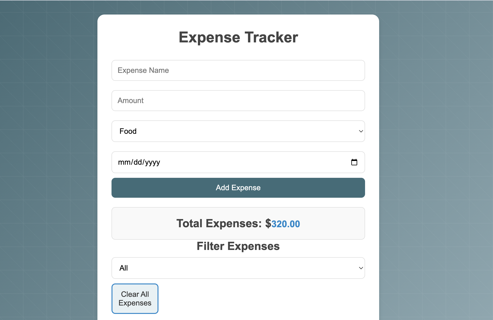
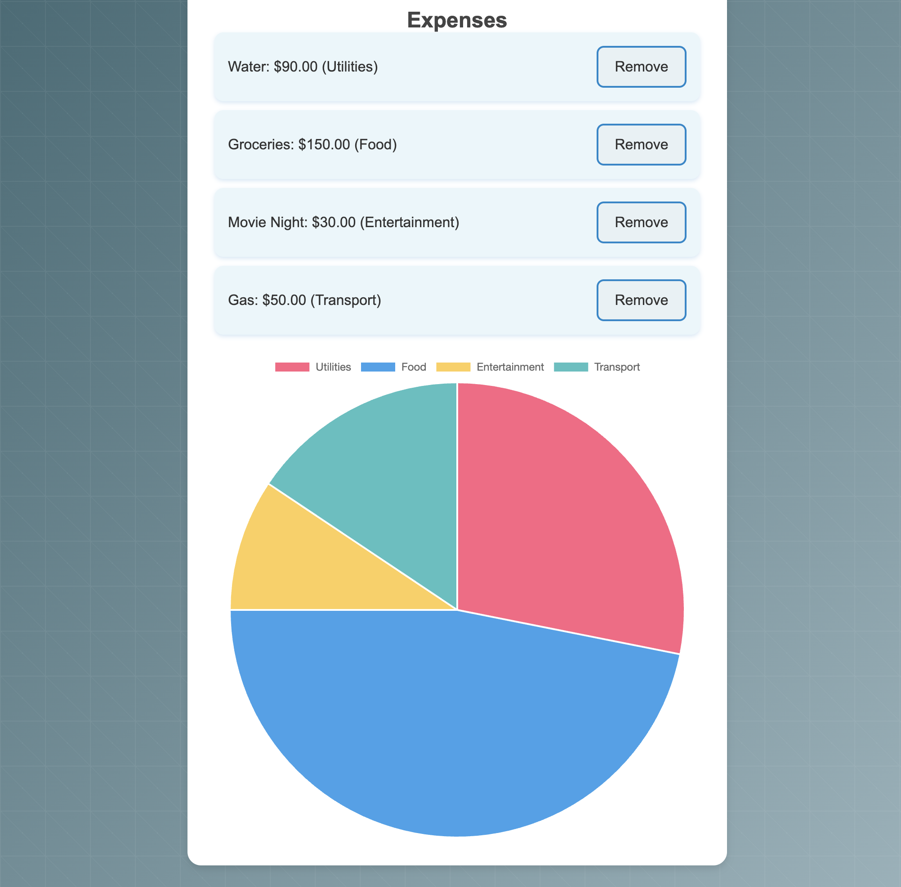

# Expense Tracker

## Overview

The Expense Tracker is a web application for managing personal expenses. Users can add, view, and categorize expenses, providing insights into spending habits through visualizations.

## Features

- **Add Expenses**: Input name, amount, category, and date.
- **Display Expenses**: List of all expenses with detailed views.
- **Summary Calculations**: Total expenses and category-based summaries.
- **Chart Visualization**: Pie charts for visual representation using Chart.js.
- **Interactivity**: Filter and sort expenses; clear all expenses option.
- **Budget Goals**: Set and track custom budget limits.

## Lessons Learned

- Improved JavaScript skills, especially in DOM manipulation and local storage.
- Gained experience with Chart.js for data visualization.
- Enhanced CSS for responsive design and usability.
- Developed problem-solving skills through debugging and user-centered design.
